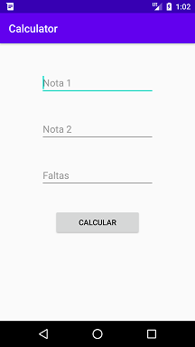
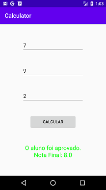

# Student Status
Projeto desenvolvido durante o Bootcamp everis Kotlin Developer da [Digital Innovation One](https://digitalinnovation.one).

Trata-se de um aplicativo simples para introdução dos conceitos iniciais do Android com Kotlin.

## Instruções
Faça o clone do projeto ou o download do código e execute o aplicativo com o Android Studio.

## Screenshots

